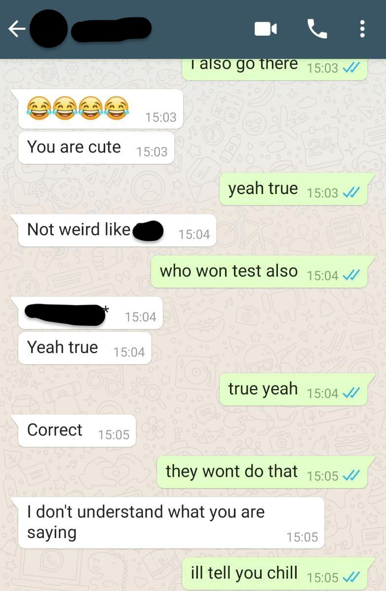

# AI Chatbot for WhatsApp Using Sequence-to-Sequence Model  

Inspired by an episode of Silicon Valley where Gilfoyle creates a chatbot to mimic Dinesh, I decided to create a similar bot that mimics my texting style to chat with friends and family on WhatsApp. This project uses a sequence-to-sequence model to achieve this functionality.

For a detailed walkthrough, read the [Medium article](https://sakshamlakhera.medium.com/converting-yourself-into-a-chatbot-and-let-ai-version-of-you-talk-to-your-friends-on-whatsapp-84b51ba32c8f).


## Features  
- **Personalized Responses**: The chatbot learns from your WhatsApp chat history to replicate your texting style.  
- **Interactive Chat**: Communicate with the bot on WhatsApp for a seamless user experience.  
- **Customizable Training**: Train the bot on specific chat data to adjust its tone and style.  

---

## Requirements  

Before running the project, ensure the following dependencies are installed:  

- Python 3.x  
- TensorFlow  
- NumPy  
- Pickle  
- Selenium (optional, for WhatsApp web interaction)  

Install the required libraries using the following command:  
```bash
pip install tensorflow numpy pickle-mixin selenium
```

## Setup Instructions

1. **Export WhatsApp Chat History**
   - Open a chat on WhatsApp.
   - Go to Options > More > Export Chat.
   - Save the exported .txt file without media attachments.

2. **Prepare Training Data**
   - Use the preprocess.py script to clean and format the exported chat data.
   - Example:
     ```bash
     python preprocess.py --input chat.txt --output formatted_data.pkl
     ```
3. **Train the Model**
   - Train the sequence-to-sequence model using the prepared data:
     ```bash
     python train.py --data formatted_data.pkl --epochs 50 --batch_size 32
     ```

4. **Run the Chatbot**
   - Start the chatbot and interact with it:
     ```bash
     python chatbot.py
     ```

## Project Structure
📁 ai-chatbot-whatsapp  
├── preprocess.py       # Script to clean and format chat data  
├── train.py            # Script to train the sequence-to-sequence model  
├── chatbot.py          # Script to run the chatbot interface  
├── data/               # Directory to store training data and chat history  
├── models/             # Directory to save trained models  
└── README.md           # Project documentation  

## Example Chatbot Interaction
User: Hey, what's up?  
Bot: Not much, just chilling. What's up with you?  

User: How’s the weather?  
Bot: It's pretty good here. How about there?  



## Contributing

Contributions are welcome! To contribute:

1. Fork the repository.
2. Create a new branch for your feature or bug fix.
3. Commit your changes and push them to your fork.
4. Submit a pull request.

## License

This project is licensed under the MIT License.

## Acknowledgments

- Inspired by the TV show Silicon Valley.

